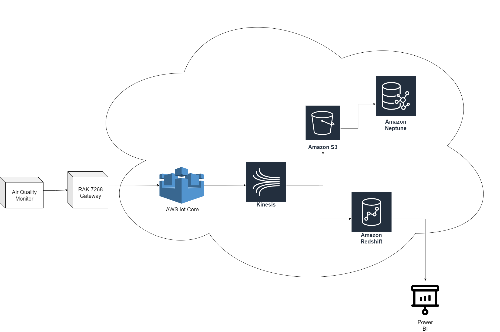
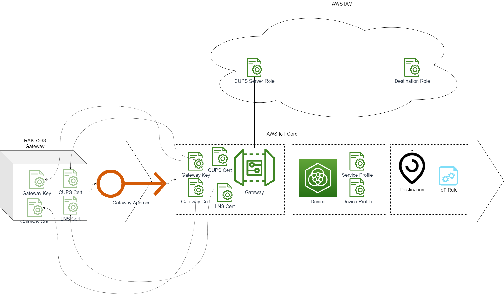
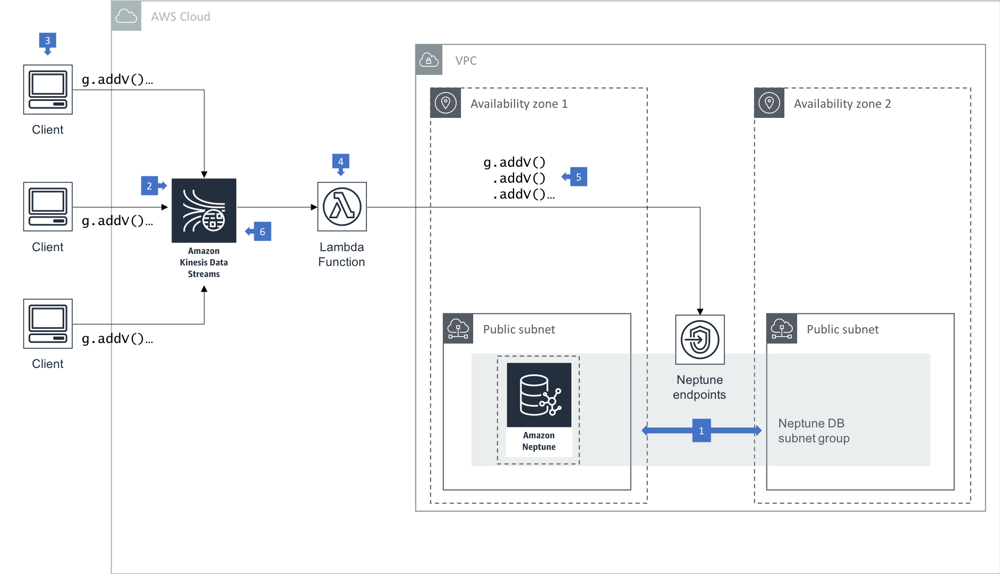
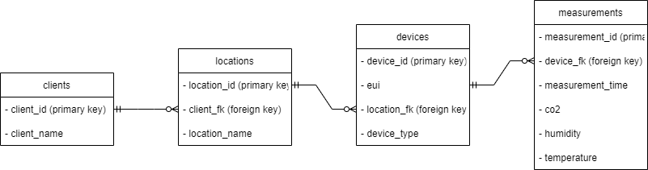
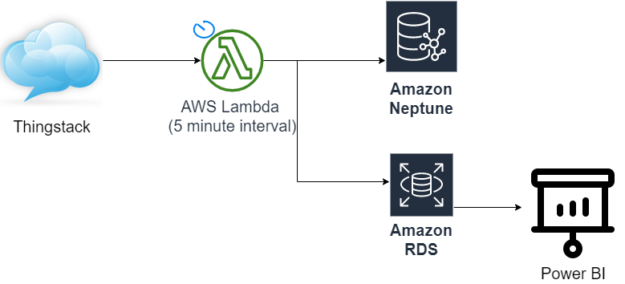

<style>
  code {
    white-space : pre-wrap !important;
    word-break: break-word;
  }
</style>

## Overview:

The network integration deliverable of the project involved connecting the existing LoRaWAN gateway and air quality device to AWS infrastructure via IoTCore, Kinesis, S3, Lambda, and RDS.


> The planned solution architecture. Note that Amazon Kinesis could optionally be routed directly to the Neptune instance. This decision would depend on a weighing of priorities: data could be inserted in batch after being stored on S3 to reduce lambda uptimes, at the cost of a slight delay in the pipeline load process.

Although the other components of this integration were quickly established, connectivity between the LoRaWAN gateway device and AWS IoTCore consistently failed. This despite meticulous attention to the RAK LoRaWAN documentation, and repeated troubleshooting. 

A progress report on the two major components of this stack (IoT Core and Neptune) is detailed below, along with a suggested stopgap measure for connectivity utilising Emu Data's existing ThingStack infrastructure. 

## IoT Core Integration:

In order to connect IoT devices to AWS IoT Core infrastructure, a number of elements need to be configured.



The key components of the IoTCore implementation are:

1. An IoT Core Gateway element. This records the information of the physical LoRaWAN gateway device to facilitate it's connection.
2. An IoT Core Device element. This records the information of the physical measurement device to facilitate a subscribable feed of the data associated with it.
3. An IoT Core Destination. This has an associated rule which routes data to its desired outputs/ingestion points.

### IoT Core Gateway Configuration:
In order to configure the gateway element, an AWS IAM role needs to be employed for CUPS server connection, with the following policy: 

```JSON
{
    "Version": "2012-10-17",
    "Statement": [
        {
            "Sid": "IoTWirelessGatewayCertManager",
            "Effect": "Allow",
            "Action": [
                "iot:CreateKeysAndCertificate",
                "iot:DescribeCertificate",
                "iot:ListCertificates",
                "iot:RegisterCertificate"
            ],
            "Resource": "*"
        }
    ]
}
```

> The policy name **must** be `AWSIoTWirelessGatewayCertManager`. Unfortunately, AWS IAM currently supplies a policy of this name by default, which does not allow the `iot:RegisterCertificate` action, and which cannot be edited. The lack of this action may be a factor in the failure of the integration to date. 

The gateway trust relationship should be configured as follows:

```JSON
{
    "Version": "2012-10-17",
    "Statement": [
        {
            "Effect": "Allow",
            "Principal": {
                "Service": "iotwireless.amazonaws.com"
            },
            "Action": "sts:AssumeRole",
            "Condition": {}
        }
    ]
}
```

In the process of configuring the gateway, various associated certificates and credentials are generated. These credentials need to be input to the physical gateway device in order to facilitate it's connection to the AWS infrastructure.

### IoT Core Device Implementation:
The AWS device architecture offers four possible connection modes: OTAA v1.0x; OTAA v1.1; ABP v1.0x; or ABP v1.1.

Each of these asks for associated data which must be gathered from the physical sensor device. The choice of which connection mode to employ is free, however the service profile and device profile chosen must match the requirements of the connection mode. The service profiles available favoured connection with ABP v1.0x, requiring the sourcing of the following data:

- DevEUI
- DevAddr 
- NwkSkey
- AppSkey

### IoT Core Destination Implementation:
The IoT Core destination also requires a matching IAM role, with the following policy definition:

```JSON
{
    "Version": "2012-10-17",
    "Statement": [
        {
            "Effect": "Allow",
            "Action":
            [
                "iot:DescribeEndpoint",
                "iot:Publish"
            ],
            "Resource": "*"
        }
    ]
}
```

The role trust relationship should be as follows:

```JSON
{
    "Version": "2012-10-17",
    "Statement": [
        {
            "Sid": "",
            "Effect": "Allow",
            "Principal": {
                "Service": "iotwireless.amazonaws.com"
            },
            "Action": "sts:AssumeRole",
            "Condition": {}
        }                                       
    ]
}
```

The destination rule consists of an SQL statement which selects data from the incoming data stream and triggers one or more actions based on it. In this case, the desired actions would be to direct data to the amazon kinesis data infrastructure. As the connection has not been successfully implemented, this rule remains unconfigured.

## AWS Neptune Integration:
Although the data connection was unable to be established from the physical device infrastructure, the agile methodology employed by the team allowed for the Neptune database to be created and for data architecture to be designed. 

The data used in this process was gathered from existing ThingStack storage, and was also employed in the development of the PowerBI dashboard.

Connection to the Neptune database can be established both through the database endpoint as depicted below, or through an online integrated `.ipynb` notebook REPL from the AWS dashboard, using the `Gremlin` addon for python.



The following entity relationship achitecture was formulated to store information from the data stream:



> This diagram uses relational database format. In a Neptune database, foreign keys would be replaced by edges, and id fields would be labelled simply `id`.

An example of the `Gremlin` code to add a measurement to the database is given below:

```python
g.V().has('eui', 'a81758fffe0634f4').addE('measured').to(__.V('measurement').property('time', '2022-03-27T00:39:01.907238528Z').property('co2', 401).property('temp', 25.8).property('humidity', 66))
```

## Suggested Stopgap Integration 

Since the connection between the physical device infrastructure and AWS IoT Core is yet to be established, we recommend that an automatically scheduled AWS Lambda function be implemented to scrape the existing ThingStack data store at five minute intervals and pipe data from this source into the desired outputs/storage formats.

Code to scrape this data was generated when it became apparent that the IoT Core implementation would not be possible within the available timeframe:

```python
import requests
import datetime
import json
import re
import hashlib

def format_data(input):
    """Takes data from the ThingStack API returns and formats it into a JSON array."""
    
    text = input.split("\n")
    
    elements = [json.loads(element) for element in text if element]

    formatted_data = []

    for element in elements:
        if "decoded_payload" in element["result"]['uplink_message'].keys():
            formatted_data.append(
                {
                    **{key: element["result"]['uplink_message']["decoded_payload"][key] for key in element["result"]['uplink_message']["decoded_payload"].keys() & {"co2", "humidity", "temperature"}},
                    "measurement_id": int(hashlib.sha1(f'{element["result"]["end_device_ids"]["device_id"]}{element["result"]["uplink_message"]["received_at"]}'.encode("utf-8")).hexdigest(), 16) % (10 ** 16),
                    "time": element["result"]['uplink_message']["received_at"],
                    "device_id": element["result"]["end_device_ids"]["device_id"]
                }
            )

    return formatted_data


headers = {
    'Authorization': 'Bearer TOKEN_GOES_HERE',
    'Accept': 'text/event-stream',
}

current_time = datetime.datetime.now(datetime.timezone.utc) - datetime.timedelta(days = 1)
timestring = str(current_time.isoformat()[:-6])

url = "https://control-data.au1.cloud.thethings.industries/api/v3/as/applications/qut/devices"

device_info = {
    "air_quality": {
        "device_ids": ["eui-a81758fffe0634f4"]
    },
    "occupancy": {
        "device_ids": [...]
    }
}

for upload, upload_info in device_info.items():
    print(f"getting data from {upload}")

    data = []
    
    for device in upload_info["device_ids"]:
        data.extend(format_data(requests.get(f'{url}/{device}/packages/storage/uplink_message?after={timestring}Z', headers=headers).text))
    print("Gathering data...")
    print("DATA GATHERED: ")
    print(data)  
```

This would allow for an implementation along the following lines:

